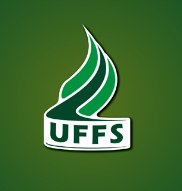

  

  &#xa0;

<h1 align="center">GCS817 — Planejamento e Gestão de Projetos</h1>

  Ciência da Computação 
  Universidade Federal da Fronteira Sul (UFFS) · Campus Chapecó · 2026

  
  
  
  

  <a href="#dart-sobre">Sobre</a> &#xa0; | &#xa0;
  <a href="#configuração-de-ambiente">Ambiente</a> &#xa0; | &#xa0;
  <a href="https://github.com/Pedrinhonitz" target="_blank">Autor</a>

 

## :dart: Sobre ##

Este trabalho da disciplina **GCS817 — Planejamento e Gestão de Projetos** aplica práticas de planejamento, execução e acompanhamento de sprints ao desenvolvimento de um sistema orientado a dados de **crimes ambientais**, utilizando alertas do [MapBiomas Alerts](https://alerta.mapbiomas.org/).

O objetivo é entregar incrementos a cada sprint (código, documentação e artigo científico), mantendo rastreabilidade das decisões e do progresso do projeto.

**Autor:** Bruno Schramm Vendruscolo e Pedro Henrique Klein

## Configuração de ambiente ##

> A implementação ainda está em andamento

Feito por <a href="https://github.com/Vendru" target="_blank">Vendru</a> e <a href="https://github.com/Pedrinhonitz" target="_blank">Pedrinhonitz</a>

&#xa0;

<a href="#top">Voltar ao topo</a>
